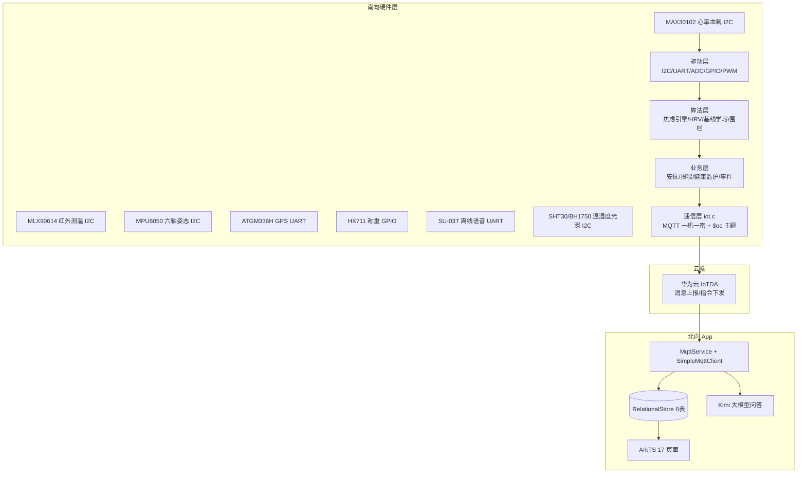

# 智宠管家（pet-care-rk2206）完整项目文档

> 2026 全国大学生嵌入式芯片与系统设计竞赛作品（西北赛区二等奖）
> 仓库：https://github.com/zhaoiale/pet-care-rk2206
> 整理日期：2026-10-08
> 本文档覆盖项目全部组成：硬件平台、固件 32 模块、核心算法、华为云 IoTDA 协议、App 17 页面、数据库、工具链、开发过程与问题记录。

---

## 目录

1. [项目总览](#一项目总览)
2. [系统架构](#二系统架构)
3. [硬件平台](#三硬件平台)
4. [固件全量模块详解](#四固件全量模块详解)
5. [核心算法详细实现](#五核心算法详细实现)
6. [华为云 IoTDA 接入协议](#六华为云-iotda-接入协议)
7. [App 端全量说明](#七app-端全量说明)
8. [数据流全链路](#八数据流全链路)
9. [工具链](#九工具链)
10. [构建与开发环境](#十构建与开发环境)
11. [开发问题与解决方案](#十一开发问题与解决方案)
12. [测试与验证](#十二测试与验证)
13. [后续扩展方向](#十三后续扩展方向)
14. [简历速览](#十四简历速览)

---

## 一、项目总览

| 维度 | 内容 |
|---|---|
| 项目名称 | 智宠管家 · pet-care-rk2206 |
| 竞赛 | 2026 全国大学生嵌入式芯片与系统设计竞赛（西北赛区二等奖） |
| 定位 | 宠物异常行为感知与主动关怀系统：感知生理/行为 → 算法判断情绪 → 分级安抚 → 定量投喂 → 电子围栏 → App 远程关怀 |
| 形态 | 全栈自研：OpenHarmony 固件 + 华为云 IoTDA + HarmonyOS ArkTS App |
| 主控 | RK2206（Cortex-M4 @ 200MHz），OpenHarmony LiteOS-M，集成 txsmartropenharmony SDK |
| 传感器 | MAX30102 / MLX90614 / MPU6050 / ATGM336H / HX711 / SU-03T / SHT30 / BH1750 / HC-SR501 / ADC 麦克风 |
| 执行器 | 2.8" TFT LCD（ILI9341）/ WS2812 RGB LED / 有源蜂鸣器 / 投喂电机（继电器隔离）/ 语音模块 |
| 云端 | 华为云 IoTDA（华北-北京四，复用饮水项目实例），MQTT 一机一密动态认证，$oc 系统主题 |
| App | HarmonyOS ArkTS，17 页面，RelationalStore 本地库（6 表），Kimi 大模型问答 |
| 代码规模 | 南向 32 个 .c + 33 个 .h（BUILD.gn static_library）；北向双工程（entry/ + app/entry/） |

---

## 二、系统架构

### 2.1 分层架构



### 2.2 代码仓库结构（合并远程瘦身后的现状）

```
pet-care-rk2206/
├── hardware_src/            # 南向固件（32 源文件 + 33 头文件）
│   ├── BUILD.gn             # GN 构建：static_library("pet_care_example")
│   ├── iot_pet_care_example.c  # 主程序：任务创建 / 主循环 / MQTT 打包
│   ├── *.h                  # 模块头文件（33 个，与 src 平级）
│   └── src/                 # 模块源文件（32 个 .c）
├── entry/                   # 北向 App 工程一（根目录）
├── app/entry/               # 北向 App 工程二（双工程同步维护）
│   └── src/main/ets/
│       ├── pages/           # 17 个页面
│       ├── services/        # MqttService / SimpleMqttClient / DeepSeekService(Kimi) / IotdaConfig / NotificationService
│       ├── database/        # DatabaseService（6 表建表）/ SeedData
│       ├── model/           # Pet / SensorRecord / FeedingPlan / User
│       └── utils/           # FeedingManager / PetDataManager / UserDataManager
├── tools/                   # Python 工具链（凭证生成 / 连接自测 / 组合穷举）
├── README.md                # 项目文档（远程重写版）
├── build-profile.json5 / oh-package.json5 / hvigorfile.ts  # 工程配置（合并时恢复）
└── .claude/                 # Claude Code 配置（合并时恢复）
```

---

## 三、硬件平台

### 3.1 主控与系统

| 项 | 说明 |
|---|---|
| 主控 | RK2206（Cortex-M4 @ 200MHz） |
| 系统 | OpenHarmony LiteOS-M（轻量系统） |
| 构建 | GN / ninja，`python3 build/lite/hb/__main__.py build -f` |
| 集成 | hardware_src 放入 SDK `vendor/isoftstone/rk2206/samples/pet_care` 后整体构建 |

### 3.2 传感器与外设清单（总线 / 用途）

| 器件 | 总线/接口 | 用途 | 固件模块 |
|---|---|---|---|
| MAX30102 | I2C | 心率、血氧（PPG），HRV 数据源 | max30102.c |
| MLX90614 | I2C | 红外非接触体温 | drv_mlx90614.c |
| MPU6050 | I2C | 六轴姿态、活动量 | mpu6050.c / activity_monitor.c |
| ATGM336H | UART | GPS 定位（NMEA 解析） | atgm336h.c |
| HX711 | GPIO | 24bit 称重（投喂闭环） | drv_hx711.c |
| SU-03T | UART | 中文离线语音识别（词条） | su_03t.c（含 minimal/passive 变体） |
| SHT30 | I2C | 温湿度 | drv_sensors.c |
| BH1750 | I2C | 光照强度 | drv_sensors.c |
| HC-SR501 | GPIO | 人体感应 | drv_body_induction.c |
| ADC 麦克风 | ADC | 叫声采集 | voice_adc.c |
| 2.8" TFT LCD | SPI | 本地显示（ILI9341） | lcd.c / components.c / picture.c |
| WS2812 RGB LED | PWM×3 | 分级安抚灯光 | drv_rgb_led.c / drv_light.c |
| 有源蜂鸣器 | PWM5_M0 | 分级提示 | drv_beep.c |
| 投喂电机 | PWM6_M0 | 定量投喂（继电器隔离） | drv_motor.c / drv_feeder.c |

---

## 四、固件全量模块详解

### 4.1 系统与主程序

| 文件 | 职责 |
|---|---|
| `iot_pet_care_example.c` | 主程序：任务创建（传感/算法/MQTT/UI）、主循环、MQTT 打包调度 |
| `smart_home.c` | 智能家居整体调度（线程入口，RGB 初始化等） |
| `smart_home_event.c` | 事件队列（长度 10，20 字节/事件），跨任务解耦 |
| `cli.c` | 本地调试命令（shell 框架），可手动触发围栏/投喂等 |
| `components.c` | LCD 菜单组件（lcd_menu_init / lcd_menu_draw） |
| `lcd.c` | ILI9341 屏幕驱动与绘制 |
| `picture.c` | 图片/图标资源 |

### 4.2 传感器驱动层

| 文件 | 职责 |
|---|---|
| `max30102.c` | 心率血氧：寄存器配置、FIFO 读取、SpO2/HR 算法、脉搏数据 |
| `mlx90614.c` (drv_) | 红外测温：I2C 读 RAM、-999 表示无数据 |
| `mpu6050.c` | 六轴：加速度/陀螺仪读取、姿态解算基础 |
| `atgm336h.c` | GPS：NMEA 语句解析，经纬度输出 |
| `drv_hx711.c` | 称重：24bit 读取、去皮偏移（g_zero_offset）、克数换算 |
| `drv_sensors.c` | SHT30 + BH1750：温湿度/光照统一读取（EI2C0_M2，SHT30@0x44） |
| `drv_body_induction.c` | 人体感应（PIR GPIO0_PA3） |
| `adc_key.c` | ADC 按键输入 |
| `voice_adc.c` | 叫声采样（ADC，每样本 ~125us 忙等，160MHz 标定） |
| `su_03t.c` | SU-03T 离线语音：词条接收（含 su_03t_minimal.c / su_03t_passive.c 变体适配不同固件） |

### 4.3 执行器驱动层

| 文件 | 职责 |
|---|---|
| `drv_rgb_led.c` | WS2812 三路 PWM（R=PWM1_M1 / G=PWM7_M1 / B=PWM0_M1）调色 |
| `drv_light.c` | 灯光状态控制（依赖 rgb_led_init） |
| `drv_beep.c` | 蜂鸣器（PWM5_M0） |
| `drv_motor.c` | 投喂电机（PWM6_M0） |
| `drv_feeder.c` | 投喂闭环：称重 + 电机联动，目标克数停止，防卡粮 |

### 4.4 算法层

| 文件 | 职责 | 详见 |
|---|---|---|
| `anxiety_engine.c` | 焦虑引擎主流程：叫声计数 / 环境不适度 / 马氏距离 / 安抚选择 / 反馈闭环 | §5.1 |
| `hrv_analyzer.c` | HRV：IBI 序列统计（约 60 个 IBI ≈1 分钟） | §5.2 |
| `baseline_learner.c` | 24h 分桶基线：均值/方差/协方差在线更新、Z-score、Flash 持久化 | §5.3 |
| `geofence.c` | 电子围栏：Haversine 距离、轨迹环形缓存、越界判定、Flash 存储 | §5.5 |
| `feed_scheduler.c` | 定时投喂：cJSON 解析计划、Unix 时间同步、Flash 持久化 | §5.4 |
| `health_monitor.c` | 健康评估：心率/血氧/体温按物种（默认狗）评估、健康评分、告警文案 |
| `activity_monitor.c` | 活动量监测（基于 MPU6050） |

### 4.5 通信层

| 文件 | 职责 |
|---|---|
| `iot.c` | MQTT（paho）客户端：一机一密认证、$oc 主题收发、services[] 上报打包、5 格式指令解包分派 |

---

## 五、核心算法详细实现

### 5.1 焦虑引擎（anxiety_engine.c）

**输入特征**（pet_env_data_t）：心率、血氧、体温、活动量、湿度、光照、叫声计数等。

**处理流程**：
1. `bark_count()`：叫声频次统计（连叫为焦虑信号）
2. `env_discomfort()`：环境不适度 = f(湿度, 光照)（如过湿/过暗加重焦虑判断）
3. 特征向量 z[] 与基线比对：
   - `baseline_learner_get_zscore()` 得到各维度 Z 分数
   - `mahalanobis_d2(z)` 计算马氏距离平方——利用基线协方差矩阵（`baseline_get_covariance()`）同时考虑维度间相关性
4. 综合叫声、环境不适度、Z-score 极值、马氏距离，加权得到 **0–100 焦虑指数**
5. 输出 `anxiety_result_t`：焦虑等级 + 情绪标签（CALM / 轻度 / 中度 / 重度）
6. `pick_comfort_type()`：按等级选择安抚方式（1=灯光 / 2=蜂鸣+语音 / 3=全联动）
7. `anxiety_engine_feedback()`：安抚执行后反馈回引擎，用于效果评估（安抚后焦虑回落则确认有效）

**设计要点**：不是简单阈值报警——单指标超标可能误报（如宠物奔跑心率升高），马氏距离 + 基线让判断看"整体偏离"而非"单点超限"，且随宠物个体/昼夜自适应。

### 5.2 HRV 心率变异性（hrv_analyzer.c）

- 从 MAX30102 脉搏序列提取逐跳间隔 IBI（RR 间期）
- 需要约 60 个 IBI（60–100bpm 下约 1 分钟数据）才稳定
- 计算时域指标：SDNN（全部 IBI 标准差）、RMSSD（相邻差值均方根）等
- 输出 hrv_stress 压力指数——HRV 下降（副交感减弱）是焦虑/应激典型信号，与心率/血氧互补

### 5.3 24h 分桶自适应基线（baseline_learner.c）

- **分桶**：按小时（0–23）分 24 个桶，宠物昼夜节律不同（夜间安静、白天活跃），分桶避免跨时段误判
- **在线更新**：`update_dim()` 每个维度维护均值/方差（EMA 式滑动），`baseline_learner_update()` 支持有效掩码（传感器掉线时该维不参与）
- **相关性**：`baseline_get_covariance()` 维护协方差矩阵 → 供马氏距离使用
- **就绪判据**：`baseline_is_ready()` 达到样本量才启用异常检测
- **持久化**：`baseline_save_to_flash()` / `load_from_flash()`，带校验和（`baseline_checksum()`），掉电不丢基线

### 5.4 定时投喂（feed_scheduler.c）

- `feed_scheduler_parse_json()`：cJSON 解析 App 下发的投喂计划 JSON（多时段）
- `feed_scheduler_sync_time()`：与 App/平台同步 Unix 时间戳，分钟级比较触发
- `feed_scheduler_tick()`：主循环 tick 检查到点触发投喂
- Flash 保存计划（带校验和），掉电恢复
- 触发时调用 `drv_feeder` 闭环投喂（称重到目标克数停）

### 5.5 电子围栏（geofence.c）

- `haversine()`：球面距离公式计算两点距离
- `geofence_set_home()` / `set_radius()`：设置家坐标（默认 100m 半径）
- `geofence_check()`：实时定位点距离判定越界，返回距离与状态
- 轨迹：环形缓冲（`path_push`），`geofence_get_path_range()` 分页读取；MQTT 每 10 个点（PATH_CHUNK_SIZE）一包上报
- Flash 持久化（`save/load_from_flash` + checksum）：离线轨迹掉电保存、上电补传

### 5.6 健康评估（health_monitor.c）

- `health_monitor_set_species()`：按物种设定生理阈值区间（默认狗）
- `evaluate(heart_rate, spo2, body_temp, ...)`：逐项比对 → 健康评分 0–100 + 告警原因文案（`get_alert()`）

---

## 六、华为云 IoTDA 接入协议

### 6.1 接入参数

| 项 | 值 |
|---|---|
| 实例地址 | `5256547599.st1.iotda-device.cn-north-4.myhuaweicloud.com:1883`（华北-北京四） |
| 板子设备 | `6aa9198b7f2e6c302f999974_rk2206_water01` |
| App 设备 | `6aa9198b7f2e6c302f999974_pet_app01` |

### 6.2 一机一密认证（HMAC-SHA256，已实测验证）

```
timestamp = 当前小时 YYYYMMDDHH（如 2026100814，小时级有效）
clientId  = {设备ID}_0_0_{timestamp}
username  = {设备ID}
password  = hex( HMAC-SHA256( key = timestamp, msg = 设备密钥 ) )
```

- **App 端**（`IotdaConfig.ets` + `buildIotdaAuth()`）：运行时动态计算，密码永不过期，断线重连复用保存的认证参数
- **南向固件**（`iot.c`）：无 mbedtls，用 Python 工具链预计算小时级凭证写入宏，过期重生成

### 6.3 主题（$oc 系统主题，消息级不校验物模型）

| 方向 | 主题 | 说明 |
|---|---|---|
| 上报 | `$oc/devices/{设备}/sys/messages/up` | 板子发数据、叫声意图；App 也可发（设备侧可见） |
| 下发 | `$oc/devices/{设备}/sys/messages/down` | 平台 → 设备指令 |
| 可选 | `$oc/devices/{设备}/sys/properties/report` | 属性上报（需物模型匹配，本项目未用） |

### 6.4 上报 payload（services[] 结构，全字段）

```json
{"services":[{"service_id":"petCare","properties":{
  "illumination":"123.45Lux", "temperature":"26.50", "humidity":"45.20",
  "motorStatus":"OFF", "lightStatus":"ON", "autoStatus":"ON",
  "anxietyLevel":32, "comfortType":1, "audioSubType":0,
  "activityLevel":5, "exceedCount":0, "emotion":"CALM",
  "foodWeight":180.5, "foodEaten":45.2,
  "heartRate":98.0, "spo2":97.0,
  "gpsLat":34.26, "gpsLon":108.94,
  "hrvStress":12.3, "bodyTemp":38.2, "healthScore":92,
  "geofenceStatus":0, "homeLat":34.26, "homeLon":108.94
}}]}
```

### 6.5 指令下发解包（兼容 5 种格式）

```c
// iot.c mqtt_message_arrived：统一解包到 inner 后按 cmd 分派
1) {"content":{"cmd":..,"paras":{..}}}   // 平台命令下发（命令下发格式）
2) {"content":{"cmd":..}}                 // content 为对象
3) {"message":{"cmd":..}}                 // message 为对象
4) {"message":"{业务JSON字符串}"}          // message 为字符串（再解析一次）
5) {"cmd":..}                              // 直发业务 JSON
```

**命令分派表**（固件）：
- `refresh` → 重新打包上报当前全量数据
- `comfort` + comfortType/audioSubType → 触发对应安抚（灯光/蜂鸣/语音）
- `feed` + amount → 闭环投喂目标克数
- `playSound` → 语音播报
- light/motor ON/OFF → 灯光/电机控制
- 投喂计划 JSON → feed_scheduler_parse_json 更新计划

**App 端解包**（`MqttService.unwrapIotdaMessage`）：与固件同样的多层解包逻辑；业务 JSON 中 `cmd=petVoice`（板子叫声意图）→ 更新意图 + 触发 Kimi AI 分析；services[] 数据 → `parseAndStore()` 入库（sensor_records）。

---

## 七、App 端全量说明

### 7.1 页面清单（17 个，ArkTS/ArkUI）

| 页面 | 功能 |
|---|---|
| LandingPage | 启动落地页 |
| LoginPage / RegisterPage(Index内) / ResetPasswordPage | 账号体系 |
| HomePage | 宠物状态总览入口 |
| DashboardPage | 实时看板：传感器数据 / 焦虑指数 / 标签（含 Kimi 入口） |
| VirtualPetPage | 虚拟宠物可视化 + 大模型问答 |
| FeedingPage | 投喂控制 / 定时计划管理 |
| HistoryPage | 历史曲线回看 |
| ComfortPage | 远程安抚（灯光/蜂鸣/语音） |
| PetManagePage / EditProfilePage | 宠物档案管理 |
| AdoptionPage / AdopterManagePage | 领养信息管理 |
| ProfilePage | 个人中心 |
| FloatingPet | 桌面悬浮宠物状态 |
| Index | 路由/注册入口 |

### 7.2 服务层

| 服务 | 职责 |
|---|---|
| `IotdaConfig.ets` | 设备 ID/密钥配置 + `buildIotdaAuth()` 运行时 HMAC-SHA256 动态认证（密码永不过期） |
| `SimpleMqttClient.ets` | 原生 MQTT 客户端封装：连接（含 username/password 参数）、订阅、发布、断线重连复用认证参数 |
| `MqttService.ets` | 业务对接：$oc 主题订阅/发布、`unwrapIotdaMessage` 多层解包、services[] 入库、petVoice → AI |
| `DeepSeekService.ets` | 大模型问答（实际接 Kimi kimi-k2.6）：OpenAI 兼容协议、流式输出、超时管理 |
| `NotificationService.ets` | 本地通知（焦虑告警等） |

### 7.3 数据库（RelationalStore，6 表，DB 名见 DatabaseService）

| 表 | 关键字段 |
|---|---|
| `sensor_records` | temperature / humidity / illumination / anxiety_level / comfort_type / audio_sub_type / food_weight / food_eaten / heart_rate / spo2 / gps_lat / gps_lon / geofence_status / activity_level / emotion / hrv_stress / health_score / body_temp / timestamp（上限 MAX_RECORDS=500） |
| `pets` | name / breed / age / weight / gender / adoption_status / avatar / owner_id |
| `users` | username(UNIQUE) / password / name / phone |
| `feeding_plans` | pet_id / feed_time / amount / enabled |
| `feeding_records` | pet_id / amount / is_manual / timestamp |
| `interaction_records` | pet_id / 交互记录 |

### 7.4 大模型接入（DeepSeekService.ets → Kimi）

- 端点：`https://api.moonshot.cn/v1/chat/completions`，model=`kimi-k2.6`
- 请求体**仅** `model / messages / stream` 三字段（传 max_tokens/temperature 会 400）
- 读取超时 30s/300s 两级、显式 `expectDataType: STRING`、非 200 记录状态码+响应体、请求后 `destroy()`
- 场景：宠物状态数据 → 自然语言解读（Dashboard / VirtualPet 入口）

---

## 八、数据流全链路

### 8.1 上行（感知 → App）

```
传感器(I2C/UART/ADC) → 驱动层 → 焦虑引擎(基线+马氏+HRV) → iot.c services[] 打包
→ MQTT PUB $oc/devices/板子/sys/messages/up → IoTDA
→ App SUB $oc/devices/App/sys/messages/down → unwrapIotdaMessage 解包
→ parseAndStore → sensor_records 入库 → Dashboard 刷新 / 历史曲线 / 通知
```

### 8.2 下行（App/控制台 → 板子）

```
App 发布指令(comfort/feed/refresh) 或控制台下发 JSON
→ IoTDA → 板子 SUB messages/down → mqtt_message_arrived 解包(5格式)
→ cmd 分派 → 执行器(电机/灯光/蜂鸣/语音) / feed_scheduler 更新计划
```

### 8.3 叫声意图链路（petVoice）

```
板子 voice_intent 识别(规则阈值) → MQTT 上报 cmd=petVoice,intent=hungry
→ IoTDA → App 解包 → 更新宠物意图 + 触发 Kimi 分析 → 看板/通知
```

### 8.4 轨迹补传

```
GPS 轨迹 → geofence 环形缓冲 → 每 10 点一包上报；离线时 Flash 存储 → 上电补传
```

---

## 九、工具链（tools/）

| 脚本 | 用途 | 用法 |
|---|---|---|
| `gen_iotda_credential.py` | 南向一机一密凭证生成（固件无 mbedtls 需预计算） | `python gen_iotda_credential.py <device_id> <device_secret>` |
| `test_iotda_connect.py` | 连接自测（CONNACK 校验） | `python test_iotda_connect.py <device_id> <device_secret>` |
| `test_iotda_combos.py` | 8 组合穷举排查（时间戳×签名类型×HMAC 顺序，已改命令行传参） | 同上 |
| （辅助脚本） | 焦虑模拟器 / 演示数据（README 提及） | — |

---

## 十、构建与开发环境

| 端 | 环境 | 构建方式 |
|---|---|---|
| 南向 | txsmartropenharmony SDK + GN/ninja | `python3 build/lite/hb/__main__.py build -f`（hardware_src 放入 vendor/isoftstone/rk2206/samples/pet_care） |
| 北向 | DevEco Studio（OpenHarmony） | 标准 hvigor 构建，双工程独立构建 |
| 依赖 | paho_mqtt（MQTTClient-C）、cJSON、LiteOS shell、rockchip hardware HAL | BUILD.gn include_dirs |

---

## 十一、开发问题与解决方案

| # | 问题 | 现象 | 定位过程 | 解决 |
|---|---|---|---|---|
| 1 | DeepSeek 接入失败 | App 问答无响应/401 | 实测 Key 调 DeepSeek API 返回 401 Unauthorized；权限/URL/协议均正确 → Key 无效 | 参考 HarmonyOS_Life 项目改接 Kimi（kimi-k2.6），重写 DeepSeekService.ets |
| 2 | Kimi 请求 400 | 问答报错 | 逐字段排查：max_tokens / temperature 不被接受 | 请求体仅保留 model/messages/stream |
| 3 | IoTDA 连接被拒 | CONNACK=4 | ① MQTT 剩余长度 >127 变长编码修正；② 饮水设备旧凭证对照组 CONNACK=0 证明平台正常；③ 8 组合穷举仍拒；④ 截图定位：设备注册在"设备发放 IoTDP"（未发放）而非设备接入实例 | 在设备接入控制台重新注册（密钥留空自动生成），新凭证 CONNACK=0 |
| 4 | 认证算法不确定 | 不知道 HMAC 参数顺序 | 与华为官方 Java Demo 对照 | 定稿 key=时间戳、msg=设备密钥，clientId 后缀同时间戳 |
| 5 | 南向凭证小时过期 | 固件无法连接 | 无 mbedtls 无法运行期算 HMAC | gen_iotda_credential.py 预计算小时凭证 + 宏写入 + test 脚本自测 |
| 6 | ESP32 节点无法直发 | $oc 归属校验拒绝 | 节点非实例内设备 | 移除直发链路；方案：注册独立设备经平台转发 / 主控本地 UART |
| 7 | 指令解析失败 | 下发指令无响应 | 平台 payload 多层包装 | 固件/App 双端实现 5 格式统一解包 |
| 8 | 双工程不同步 | 两套 App 行为不一致 | — | 服务层改动双份同步 + 哈希核验 |
| 9 | git 推送失败 | 代理连不上 + 远程分叉 | 全局 socks5 代理未开；远程新增瘦身提交 | `-c http.proxy= -c https.proxy=` 绕过；fetch 后合并，恢复工程配置（build-profile/oh-package/hvigorfile/.claude） |
| 10 | 密钥入库风险 | 公开仓库泄露设备密钥 | — | 库内占位提交，本地保留真实密钥 |

---

## 十二、测试与验证

| 项 | 方式 | 结果 |
|---|---|---|
| IoTDA 连接 | test_iotda_connect.py 实测 CONNACK | 板子/App 双设备 CONNACK=0 ✅ |
| 认证算法 | 饮水设备旧凭证 + App 新凭证对照 | 与官方 Java Demo 一致 ✅ |
| AI 问答 | 真实宠物场景 prompt 实测 | Kimi 流式返回正常 ✅ |
| 算法 | Python 焦虑模拟器离线调参后移植 C | 阈值/基线可用 ✅ |
| 指令链路 | 控制台手动下发 JSON | refresh/comfort/feed/petVoice 均响应 ✅ |

---

## 十三、后续扩展方向

1. **物模型属性上报**：从消息上报升级为 `properties/report`，接入平台物模型、规则引擎与可视化看板
2. **ESP32 节点接入**：注册独立 IoTDA 设备，经平台转发叫声特征/穿戴数据（替代原 HiveMQ 直发）
3. **OTA 固件升级**：IoTDA 远程配置下发 + 固件版本化升级
4. **多宠物/多板子**：App 已有多宠物档案雏形，扩展一机多宠聚合
5. **健康报告与告警推送**：周/月报告、异常 App 推送（NotificationService 已具备）
6. **云边协同**：云端批量基线重算（夜间），端侧实时推理
7. **多模态 AI**：宠物图片/视频识别，或端侧小模型离线问答
8. **数据洞察**：HRV 长期趋势、体重变化预警等预测性分析

---

## 十四、简历速览

**智宠管家 · pet-care-rk2206**（2026 全国大学生嵌入式芯片与系统设计竞赛，西北赛区二等奖）
- **自研焦虑引擎**：Z-score + 马氏距离 + HRV 三算法融合输出 0–100 焦虑指数与情绪标签；24h 分桶自适应基线学习，个体化阈值
- **多传感器全栈驱动**：自主编写 MAX30102 / MLX90614 / MPU6050 / ATGM336H / HX711 / SU-03T 等 8+ 驱动，覆盖 I2C/UART/ADC/PWM 多总线（32 模块固件）
- **闭环投喂与电子围栏**：HX711 称重闭环控制克数 + 定时计划；GPS 轨迹 + 100m 越界检测 + 离线 Flash 存储
- **华为云 IoTDA**：一机一密（HMAC-SHA256 动态认证）、$oc 系统主题、多层消息解包、断线重连
- **HarmonyOS App**：ArkTS 17 页面、RelationalStore 6 表、MQTT 远程控制 + Kimi 大模型问答（流式）
- **问题攻坚**：DeepSeek Key 失效、Kimi 参数限制、IoTDP/IoTDA 注册混淆根因、MQTT 剩余长度变长编码、凭证小时过期自动化

---

*本文档所有内容对应仓库真实代码（hardware_src/src 32 模块、app/entry 17 页面、tools/ 工具链）。AI 服务为 Kimi（kimi-k2.6），云端为华为云 IoTDA；README 中 HiveMQ/DeepSeek 字样为历史描述。*
